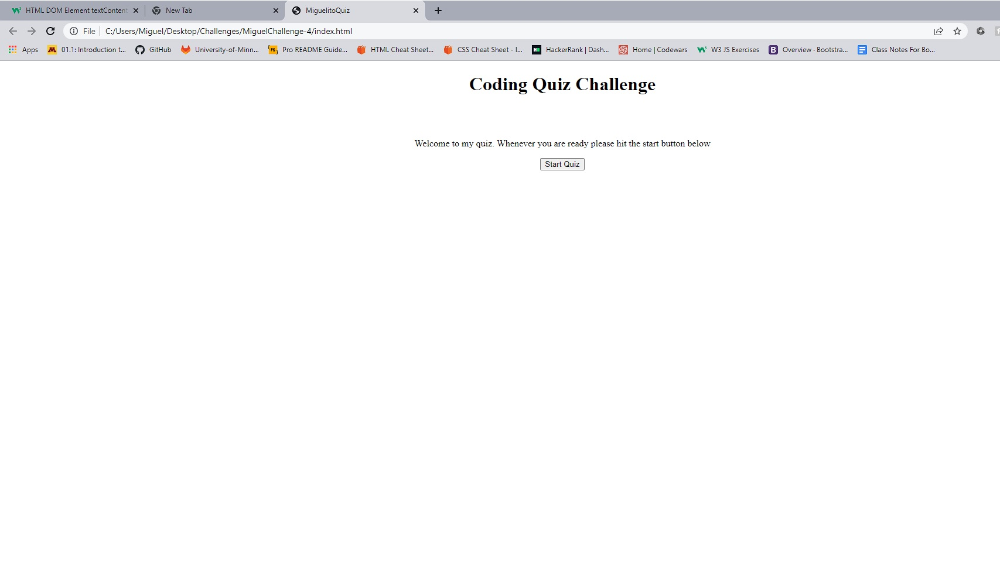

# My JavaScript Coding Quiz

## Description 
- This website quizes an individual on their javascript knowledge as well as other knowledge that they never thought would come in handy. I have created as a fun little project to test my own skills working with Methods and events.

## Table of contents
- [Description](#description)
- [Usage](#usage)
- [Credits](#credits)
- [License](#license)
- [Badges](#badges)

## Usage
- 
 Javascript coding quiz tests users on knowledge. 

- <a href="https://darkunitx.github.io/MiguelitoQuiz/">Javascript Coding Quiz Live Website</a>
- <a href="https://github.com/Darkunitx/MiguelitoQuiz">Javascript Coding Quiz Github Repo</a>

## Credits 

- In collaboration with : 

- TA Chris Stallcup

- Websites/References utilized to complete this project :
- https://codepen.io/davidcochran/pen/WbWXoa
- https://www.guru99.com/javascript-interview-questions-answers.html

## License

- MIT License

- Copyright (c) [2022] [Miguel Montenegro Javascript coding quiz]

- Permission is hereby granted, free of charge, to any person obtaining a copy of this software and associated documentation files (the "Software"), to deal in the Software without restriction, including without limitation the rights to use, copy, modify, merge, publish, distribute, sublicense, and/or sell copies of the Software, and to permit persons to whom the Software is furnished to do so, subject to the following conditions:

- The above copyright notice and this permission notice shall be included in all copies or substantial portions of the Software.

- THE SOFTWARE IS PROVIDED "AS IS", WITHOUT WARRANTY OF ANY KIND, EXPRESS OR IMPLIED, INCLUDING BUT NOT LIMITED TO THE WARRANTIES OF MERCHANTABILITY, FITNESS FOR A PARTICULAR PURPOSE AND NONINFRINGEMENT. IN NO EVENT SHALL THE AUTHORS OR COPYRIGHT HOLDERS BE LIABLE FOR ANY CLAIM, DAMAGES OR OTHER LIABILITY, WHETHER IN AN ACTION OF CONTRACT, TORT OR OTHERWISE, ARISING FROM, OUT OF OR IN CONNECTION WITH THE SOFTWARE OR THE USE OR OTHER DEALINGS IN THE SOFTWARE.

## Badges

